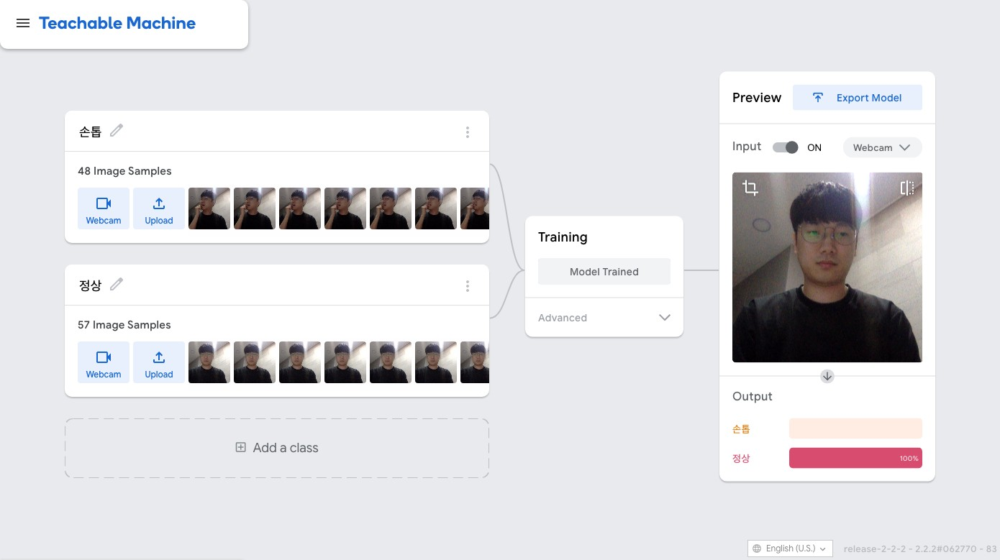

## 1일차 : 수업소개부터 ~ 모델까지

### 이론

- 결정 = 비교 + 선택
  - 컴퓨터의 등장으로 비교에서 벗어나 인간의 영영인 선택에 집중 할 수 있게됨.
  - 사람들은 선택까지 기계에게 맡기고 싶어함

- 머신러닝이란?
  - 하나를 알면 열을 안다. 라는 속담은  
  공부를 하면, 똑같은 문제뿐만 아니라 비슷한 문제도 해결할 수 있는 사람을 지칭하며 함.
  - 이러한 특성을 기계에도 부여하여  
    일부를 알려주고 스스로 결정할 수 있게 하고자하는 것이  
    기계학습, 영어로 머신러닝이다.
  - 머신러닝이란 판단력을 기계에게
    부여하는 기술이라고 할 수 있음.

- 모델이란?
  - 어린아이가 여러 물체를 입에 가져가다보면, 이것이 먹을 수 있는건지, 먹을 수 없는건지, 맛있는건지 아닌건지 판단할 수 있게됨.
  - 이처럼 기계에서도 학습(Learning)을 통해 이러한 판단력을 만들어 줄 수 있는데  
  이것을 모델이라고 한다.
  - 판단력 = "모델"
  - 학습이 잘 되어야 좋은 모델을 만들 수 있고, 모델이 좋아야 더 좋은 추측을 할 수 있으며, 추측이 좋으면 결정이 뚜렷해진다.

### 실습

- 머신러닝을 학습하기 위해 습관을 고치는 앱을 만들어보자는 목표를 세움.
- [teachablemachine](https://teachablemachine.withgoogle.com/) 사이트에서 손톱 상태와 정상 상태를 학습한 결과를 화면을 봐봄.

